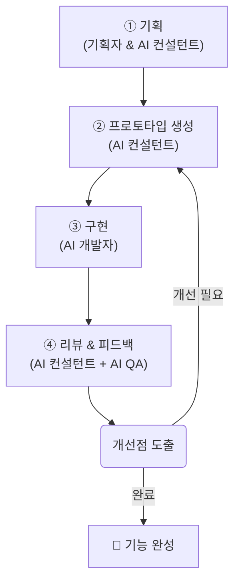

## **비개발자의 바이브코딩으로 서비스 구현하기 (Canva용)**

### **페이지 제목**

  * **제목:** 비개발자의 바이브코딩으로 서비스 구현하기
  * **부제:** AI 오케스트라를 활용한 혁신적인 개발 방법론

-----

### **섹션 1: 개요 - '바이브 코딩'의 힘**

'바이브 코딩(Vibe Coding)'은 전통적인 코딩 지식이 없는 기획자가 자신의 아이디어와 직관("Vibe")을 AI 어시스턴트들과의 협업을 통해 실제 동작하는 서비스로 구현하는 새로운 개발 방식입니다. 여러 전문 AI를 '오케스트라'처럼 지휘하여, 아이디어를 구체화하고, 설계하고, 코드로 완성하는 과정을 통해 누구나 혁신적인 서비스를 만들 수 있습니다.

-----

### **섹션 2: 주요 역할 및 책임**

| 역할 (Role) | 담당 (Assignee) | 주요 책임 (Key Responsibilities) |
| :--- | :--- | :--- |
| **기획자** | 사람(본인) | ∙ 서비스 비전 및 목표 설정  ∙ 최종 의사결정 |
| **AI 컨설턴트** | AI모델(Gemini) | ∙ 기술 아키텍처 설계 ∙ AI 개발자용 프롬프트 작성 |
| **AI 개발자** | CursorAI | ∙ 프롬프트 기반 코드 작성 및 기능 구현 |
| **AI QA** | 기타 Code Assistant (Codex 등) | ∙ 코드 버그, 스타일, 잠재적 오류 검토 |

-----

### **섹션 3: 5단계 순환 워크플로우**

1.  **기획 (Planning):** 
    - **기획자**(사람) 가 서비스의 비전과 목표를 제시하면, **AI 컨설턴트**(Gemini)가 기술 아키텍처를 설계하고 구체적인 실행 계획을 수립합니다.
2.  **프롬프트 생성 (Prompt Generation):** 
    - **AI 컨설턴트**가 확정된 기획안을 바탕으로, **AI 개발자**(CursorAI)가 즉시 코딩을 시작할 수 있도록 명확하고 상세한 지시사항(프롬프트)을 작성합니다.
3.  **구현 (Implementation):**
    - **기획자**의 감독 하에, **AI 개발자**(CursorAI)가 전달받은 프롬프트를 바탕으로 실제 코드를 생성합니다.
4.  **리뷰 & 피드백 (Review & Feedback):**
    - 구현된 결과물을 **AI 컨설턴트**가 아키텍처 관점에서, **AI QA**(Codex 등)가 코드 품질 관점에서 각각 리뷰하여 종합 피드백을 **기획자**에게 전달합니다.
5.  **개선 및 반복 (Iteration):**
    - **기획자**가 최종 피드백을 바탕으로 개선 방향을 결정하면, **AI 컨설턴트**가 이를 반영한 새로운 프롬프트를 작성하며 사이클이 다시 시작됩니다.

-----

### **섹션 4: '바이브 코딩'의 장점**

*(아이콘과 함께 나열)*

  * **높은 접근성:** 코딩 지식 없이도 서비스 구축 가능
  * **압도적 효율성:** AI를 활용한 신속한 프로토타이핑 및 개발
  * **강력한 협업:** 인간의 비전과 AI의 기술력이 결합된 시너지
  * **지속적 개선:** 내장된 피드백 루프를 통한 점진적 고도화
  * **비전 집중:** 기획자가 아이디어와 본질에만 집중할 수 있는 환경

-----

### **섹션 5: 주요 도구 및 기술**

  * **언어 모델:** Gemini, CursorAI (Claude), Codex
  * **개발 환경:** 로컬 환경 (macOS), 서버 환경 (Linux)
  * **버전 관리:** Git, GitHub

-----

### **페이지 하단 (Footer)**

  * "당신의 아이디어가 AI와 만나 현실이 됩니다."
  * *프로젝트명: 고성능 멀티모달 RAG 어시스턴트* 
  * *작성일: 2025년 8월 2일*
